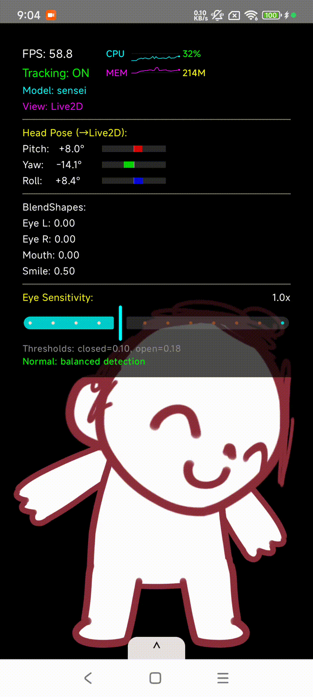

# VirtualFaceCapture-MNN
> ✨ Android 端虚拟角色面捕驱动系统，推理框架基于 [alibaba-MNN](https://github.com/alibaba/MNN).

> 🌐 English README: [README.en.md](./README.en.md)
___

## 🧠 简介
基于 **MNN** 推理引擎、在移动端复刻 **MediaPipe Face Landmarker** 面部捕捉方案，
配合 **仿 OpenSeeFace** 风格的后处理流水线，用来实时驱动 **Live2D** 皮套。(测来测去好像也就只剩 Google 的模型好用一些了 -.-

整套面捕管线已经从 MediaPipe 源码里彻底剥离出来：不依赖 MediaPipe 的图计算
（CalculatorGraph）、不依赖 JavaCV / OpenCV-Android、不依赖任何 MediaPipe Tasks
Java 层，全部由 **MNN + MNN-CV + 本地 C++ 后处理** 实现，姿态估计等部分逻辑用 **ARM NEON**
做了 SIMD 优化以提升加载与计算速度，整体帧率能在骁龙888手机运行逼近**60**帧 🎉。

---

## ✨ 运行示例

<p align="center">
  
  
</p>

---

## 🧠 方案概览

简单一句话概括为：

> **把 MediaPipe Face Landmarker 的 Detection + Landmark 两个模型搬到 MNN 上跑，
> 自己实现整套图前/图后处理，再接一层仿 OpenSeeFace 的滤波与表情解算，
> 最终输出 ARKit-52 BlendShape + 头部姿态去驱动 Live2D。**

与原版 MediaPipe Android 方案的差异：

| 维度 | 官方 MediaPipe Tasks | 本工程 (MNN 版)                                                |
|------|----------------------|------------------------------------------------------------|
| 推理引擎 | TFLite + GPU Delegate | **MNN** (CPU / GPU / NNAPI 后端可选)                           |
| 图调度 | MediaPipe CalculatorGraph | **本地 C++ 流水线**，零图计算依赖                                      |
| 图像处理 | JavaCV / OpenCV / GL | **MNN-CV** + **NEON kernel**                               |
| 模型数量 | Detection + Landmark + Blendshape | 仅 **Detection + Landmark** 两个模型，BlendShape 走单独解算           |
| 后处理 | MediaPipe 内置 | **仿 OpenSeeFace** 平滑 / 标定 / 头姿恢复                           |
| 体积 | 依赖 mediapipe_tasks_vision aar | 仅 `libMNN.so` + `libmediapipefacelandmark.so` + 2 个 `.mnn` 模型 |

---

## 🧩 流水线结构

```
            ┌───────────────────────────────┐
Camera ───► │ YUV_420_888 (Camera2/CameraX) │
            └──────────────┬────────────────┘
                           │  NEON YUV→RGB / 旋转 / 缩放
                           ▼
              ┌──────────────────────────┐
              │  FaceDetector  (MNN)     │   face_detector_mp.mnn
              │   - BlazeFace 风格        │   (含 int8 量化版本)
              └──────────────┬───────────┘
                             │ ROI 仿射裁剪 (MNN-CV)
                             ▼
              ┌──────────────────────────┐
              │  FaceLandmark (MNN)      │   face_landmark_detector_mp.mnn
              │   - 输出 478 点 3D 关键点 │
              └──────────────┬───────────┘
                             │
                             ▼
              ┌──────────────────────────────────────────────┐
              │  仿 OpenSeeFace 后处理 (C++ / Kotlin)         │
              │   • PnP / SVD 头部姿态恢复 (pitch/yaw/roll)   │
              │   • 眨眼曲线 + 嘴形 + 眉毛                    │
              │   • One-Euro / 滚动均值平滑                  │
              │   • 首帧自动标定 (calibration)               │
              │   • ARKit-52 BlendShape 解算                 │
              └──────────────┬───────────────────────────────┘
                             ▼
              ┌──────────────────────────┐
              │  Live2D Cubism Renderer  │   ARKit → Live2D 参数映射
              └──────────────────────────┘
```

所有矩阵运算 / 仿射变换 / SVD / Jacobi 旋转 / 点云变换都走本地的
`mini_linalg` + `neon_intrinsics`，针对 3×N 关键点这种典型 shape 做了
向量化，加载和首帧推理耗时相比标量实现有明显下降。

---

## 📦 模块划分

工程是一个标准的多 module Gradle 项目：

| Module | 作用                                                     |
|--------|--------------------------------------------------------|
| `:app` | Demo 应用：相机、UI、Live2D 渲染、参数映射                           |
| `:Live2D` | Cubism SDK 包装层 (CMake + JNI)                           |
| `:MediapipeFaceLandmark` | **核心推理模块**：MNN + `.mnn` 模型 + 原生 C++ 流水线 + NEON 优化      |
| `:OpenSeeFaceProcess` | 仿 OpenSeeFace 的后处理：平滑、头姿、BlendShape 解算                 |
| `:CommonData` | 共享数据类型 (`Point3D` / `HeadPose` / `ARKitBlendShapes` …) |
| `:facecapture-sdk` | 对外发布的 AAR 门面，封装上面 3 个模块                                |
| `ThirdParty/MNN/` | 仅提供头文件                                                 |

---

## 🚀 快速开始

### 构建运行

```bash
git clone https://github.com/<your-name>/VirtualFaceCapture-MNN.git
cd VirtualFaceCapture-MNN
./gradlew :app:assembleDebug
# 或直接在 Android Studio 中打开并运行 app
```

首次启动需授予相机权限，之后保持人脸在画面内，点击 Start ，即可看到 Live2D 角色随着
表情 / 头部姿态实时联动。

### 作为 SDK 集成

如果只想要面捕能力（不要 Live2D 渲染），请参考
[`facecapture-sdk/README.md`](facecapture-sdk/README.md)，门面 API 形如：

```kotlin
val engine = FaceCaptureEngine.create()
engine.initialize(context)
engine.setResultListener { result ->
    val landmarks   = result.landmarks         // 478 个 3D 关键点
    val blendShapes = result.blendShapes       // ARKit 52 BlendShape
    val pose        = result.relativeHeadPose  // pitch / yaw / roll
}
// 把 CameraX 的 ImageProxy 喂进来
engine.pushFrame(image, rotationDegrees)
```

---

## 🎮 操作指南

进入 Demo 后，屏幕底部会弹出一个可滚动的 **控制面板 (ControlPanel)**，
顶部显示当前加载的 Live2D 模型名。所有按钮 / 滑块的作用如下：

### 按钮区

| 按钮 | 状态切换 | 作用 |
|------|----------|------|
| **Start / Stop** | 红 ↔ 主色 | 启停整条面捕管线（摄像头采集 + 推理 + 驱动），关闭时模型会停在最后一帧的姿态 |
| **Show Debug / Hide Debug** | — | 显隐顶部的调试 HUD：FPS、推理耗时、头部 pitch/yaw/roll、EAR、BlendShape 数值等 |
| **Show Camera / Show Live2D** | 第三色 ↔ 第二色 | 切换主画面：Live2D 渲染视图 ↔ 相机预览 + 关键点叠加，方便排查跟踪问题 |
| **Select Model** | — | 弹出对话框选择 `assets/` 下的 Live2D 模型（默认提供 sensi / ATRI 等） |
| **Reset Baseline** | — | **基线重置**：把当前帧的头姿 / 表情记为「中性脸」，类似 OpenSeeFace 的首帧标定。佩戴眼镜、换光线、换人时建议重新点一下 |
| **Blink Curve: ON / OFF** | 绿 ↔ 第二色 | 是否启用**自动眨眼曲线整形**。开启后会把检测到的眨眼事件整形为更自然的 230 ms 曲线（避免抖动 / 半眨），关闭则直接透传原始 EAR |

### 滑块区

| 滑块 | 取值范围 | 说明 |
|------|----------|------|
| **Blink Speed** *(仅在 Blink Curve 开启时显示)* | 0.5x ～ 3.0x | 控制整形后的眨眼速度，数值越大眨眼越慢越柔和；面板会同时显示对应的毫秒数（如 `1.0x (230ms)`）。`< 0.8x` 为「Fast blink」，`> 1.5x` 为「Slow & smooth」 |
| **Eye Sensitivity** | 0.5x ～ 2.0x | 眼部 EAR 阈值的灵敏度系数。下方实时显示当前生效的 `closed / open` 阈值；`< 0.8x` 需要更大幅度的眨眼才会触发（适合大眼妆 / 戴眼镜），`> 1.3x` 则对细微动作更敏感（适合表情戏多的录播） |

> 💡 TIPS：第一次跑、或者换了模型 / 换了人脸之后，建议先正脸看镜头点一次
> **Reset Baseline**，然后根据自己的眨眼习惯把 **Eye Sensitivity** 调到刚好能稳定触发即可。

---

## 🛠 工程特点

- **零 MediaPipe 运行时依赖**：删掉了 `CalculatorGraph`、`PacketCallback`、
  `AndroidPacketCreator` 等全部 MediaPipe 框架代码，模型管线由 C++ 顺序调度，上层 Kotlin 代码做多线程并行流水线。
- **MNN-CV 替代 OpenCV**：YUV 解码、缩放、仿射、归一化全走 MNN-CV，省掉
  几 MB 的 OpenCV-Android 依赖。
- **NEON SIMD**：`neon_intrinsics.h` 中实现了点积、矩阵乘、3×N 外积、
  Jacobi 旋转、4×4 仿射变换等常用算子；用于 SVD 求头姿和 478 点云的批量
  变换，热点相比标量实现有明显提速。
- **仿 OpenSeeFace 后处理**：参考 Python 版的 `tracker.py` / `similaritytransform.py`
  重写为 C++/Kotlin，包括 One-Euro 平滑、首帧标定、眨眼曲线整形等。
- **ARKit-52 BlendShape 自解算**：不依赖 MediaPipe 的第三个 BlendShape 模型，
  直接基于 478 关键点几何关系解算，省一次推理。（其实主要是 blend shape 模型直接出来的产物很难救，但推理代码还是留在工程里了，有需要的自己用罢 :(。
- **可发布的 AAR**：`:facecapture-sdk` 模块已经配置好 `maven-publish`，
  可一键打包成独立的面捕 SDK。

---

## 📁 目录速览

```
VirtualFaceCapture-MNN/
├── app/                         # Demo + Live2D 联动
├── Live2D/                      # Cubism SDK 封装
├── MediapipeFaceLandmark/       # MNN 推理 + NEON 优化的核心
│   ├── src/main/assets/         #   .mnn 模型 (detector / landmark)
│   ├── src/main/cpp/            #   C++ 流水线、YUV、几何
│   │   └── include/face_geomentry/
│   │       ├── mini_linalg.h        # 线代
│   │       └── neon_intrinsics.h    # ARM NEON SIMD
│   └── src/main/jniLibs/        #   预编译 libMNN.so
├── OpenSeeFaceProcess/          # 仿 OpenSeeFace 后处理
├── CommonData/                  # 共享数据类
├── facecapture-sdk/             # 对外发布的 AAR 门面
└── ThirdParty/MNN/              # 仅提供 MNN 头文件 
```


---

## 💡 遗留问题

由于模型参数表现自带差异，人脸形状也是各有不同，以及点位的映射很难做到理想意义上的 0-1 值，所以实际上在 OpenSeeFaceProcess 后处理里面很多阈值设定偏向工程 trick（多次发动了俺寻思之力），目前暂时想不到一个在任何情况下都很完美的办法，如果有其他好的后处理方案欢迎直接提 PR (￣▽￣)"

---

## 🙏 借物 / 致谢

- Live2D 模型 sensi：<https://www.bilibili.com/video/BV1tk4y1n7Ls/>
- Live2D 模型 ATRI：<https://www.bilibili.com/video/BV1Rs4y187rJ>
- [google/mediapipe](https://github.com/google/mediapipe)
- [emilianavt/OpenSeeFace](https://github.com/emilianavt/OpenSeeFace)
- [alibaba/MNN](https://github.com/alibaba/MNN)